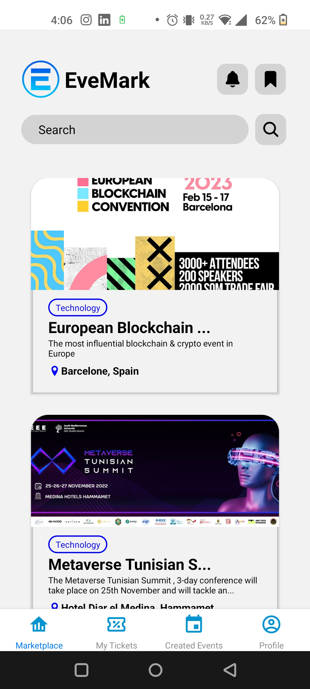
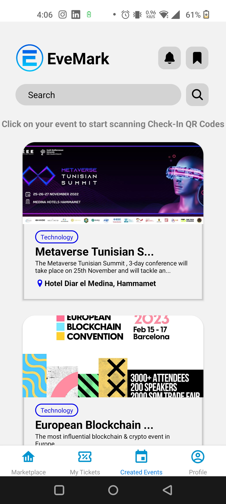
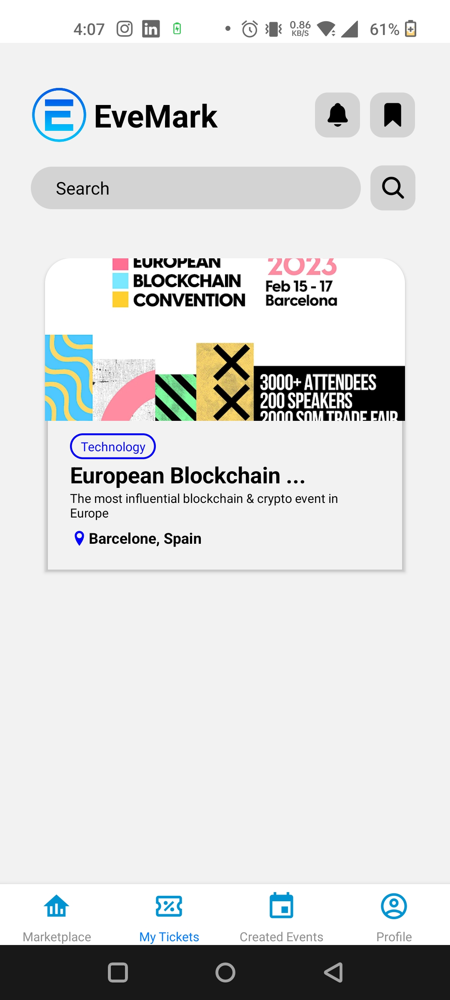
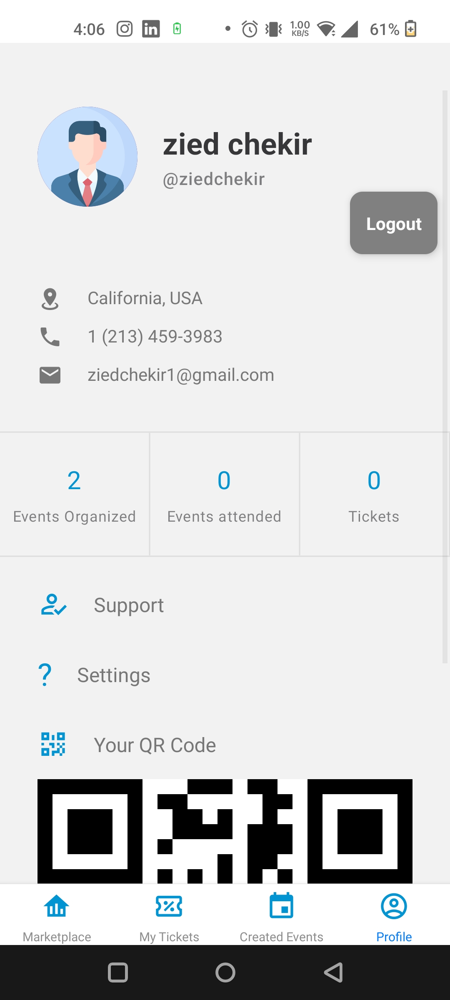
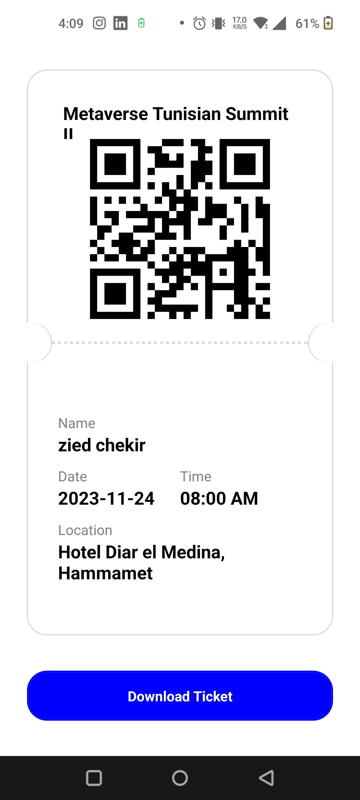

#  EveMark

An effective solution that will facilitate the astronauts’ daily tasks using Mixed Reality and Holograms.

##  Technical Details

EveMark makes use of the React Native framework, which enables the creation of cross-platform mobile apps using JavaScript and React.

The app includes features such as an event marketplace, ticket pricing, ticket sales and management, participant check-in and tracking using automatically generated QR Codes. The user interface is designed to be user-friendly and straightforward, allowing event organizers to handle the check-in of their events quickly and easily, and event attendees to find all new events in one location and book their tickets.

The app stores and manages event and participant information using the MongoDB database system. It also includes a built-in QR code scanner for event check-in.

The app is built on the React Native framework, which provides a smooth and efficient performance as well as an easy-to-maintain codebase. It provides maximum reach for event organizers by being able to deploy on both Android and iOS. Overall, EveMark provides event organizers with a comprehensive solution for managing and promoting their events, selling tickets, and tracking attendance.

##  Screenshots

<p float="left">







</p>

<p float="left">






## How To Run On Expo

### Installing Dependencies

After cloning the project, you need to install all the dependencies with you favorate package manager (we recommend yarn!)
```sh
yarn 
//or
npm install

```

### Starting the app on Expo Go

Please make sure to download Expo Go app from the playstore and then write this command in your terminal (make sure to be on the root directory of the project)

1. If both your PC and Mobile Device are connected to the same Wi-Fi you can run this command
```sh
yarn start
```
2. If your PC and Mobile Device aren't connected to the same Wi-Fi you can run this command
```sh
yarn start --tunnel
```


Finally, scan the QR Code given in the terminal with the Expo Go app QR Code scanner and the app will run on your device.


##  How To Build

### Creating Expo Account

You will need an expo account to use Expo Application Services. So, to create your expo account go to their [website](https://expo.dev), click Sign Up button in the top-right corner and complete the registration process. After that, confirm your email address, and you are ready to go!

### Installing Expo Application Services

Before you can start using Expo Application Services you need to install it by opening the terminal and typing:
```sh
yarn add eas-cli
```

Once the installation is finished, you can login to our expo account by typing eas login in the same terminal and providing the username as well as the password of the expo account that you have created earlier. (You can test if you logged in successfully by typing eas whoami in the terminal, which should display your username).

### Configuring The Project

The last step before you can start creating our first build is to configure the project. you can simply do that by running eas build:configure in the terminal, and choosing android as our platform. This command will create eas.json file in your project.

### Creating The Build

Finally you can create our first build! So let's not waste any time and start doing that by running 
```sh
eas build --platform android 
```

If you don't have an Android Keystore, then EAS will ask you if you need one, select Yes and EAS will take care of the rest.

Once the status of the progress changes to Finished, it means that finally you have our application build, and you can download it by clicking Download button. 


##  Demo Video

https://user-images.githubusercontent.com/93081163/208190123-74d83fd1-5950-4d28-b7fa-1a174c0322e8.mp4

##  Test It Yourself

You can install EveMark and test it yourselves on your android phones by following this [link](https://www.mediafire.com/file/dwg4vmlam8t383k/evemarkv3.apk/file) or by scanning this QR Code.

<p align="center">


</p>


